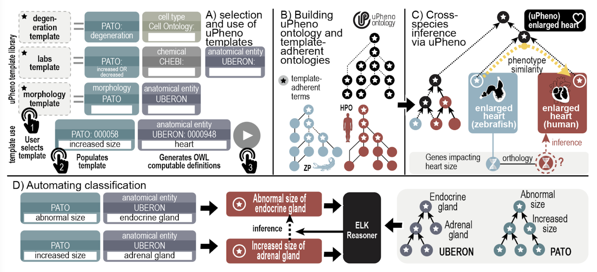

<h2 class="page-title">The Unified Phenotype Ontology (uPheno)</h2>

The Unified Phenotype Ontology (uPheno) is an effort led by the Monarch Initiative to integrate phenotype terminologies across species. uPheno has to major components: an OWL ontology that imports and deeply integrates phenotype ontologies from a variety of species, including Human and several major model organisms (such as Drosophila, Zebrafish, Xenopus, C. elegans, and Mouse), and a library of phenotype ontology term templates that are developed by the <a href="https://github.com/obophenotype/upheno/wiki/Phenotype-Ontologies-Reconciliation-Effort">Phenotype Ontologies Reconciliation Effort</a>. 

    <figure class="ecosystems">
          
          <figcaption>
          Fig 1. <strong>uPheno template-driven ontology development and harmonization.</strong> A. uPheno templates are used to define phenotypes according to agreed design patterns. B. Computable definitions specified using uPheno templates are used to automate classification of uPheno and parts of ZP (dashed lines) as described in panel D. C. Computable definitions also drive automated classification of HP and ZP classes under uPheno classes. For example, enlarged heart in ZP (defined using the zebrafish anatomy heart term) and enlarged heart in HPO are both classified under uPheno enlarged heart (defined using Uberon heart). Algorithms can use this classification under uPheno to predict that human orthologs of zebrafish genes annotated to enlarged heart may cause enlarged heart in humans. Variant prioritization more typically matches the profile of phenotypes associated with a disease with those associated with variants in a model organism gene using the ontology classification to support statistical matching (Figure 7). D. Automating classification: Terms defined using templates follow a standard design pattern, allowing reasoning software (ELK) to leverage classifications in external ontologies (Uberon and PATO) to classify phenotypes.
          </figcaption>
    </figure>

uPheno provides a common framework for the representation of phenotype terms and integrates all domain-specific phenotype ontologies into a single, unified, ontology. The common representation framework ensures a rich and consistent axiomatisation that enables expressive querying and effective classification of phenotypes across species and modalities. For example, a user might be interested in grouping all phenotypes related to abnormalities in a metabolic process that occur in a part of the digestive system. Integrating all domain-specific phenotype ontologies in a single, unified resource will drive the following use cases:
<ol>
<li>Cross-species analysis. uPheno enables the straightforward retrieval of both analogous and similar phenotypes across taxons. This can be used for a variety of applications, from finding relevant literature across species to identifying candidate genes for phenotypes with an unknown genetic basis.</li>
<li>Cross-domain phenotype curation: uPheno enables the curation of species-independent phenotypes as well as species-specific ones, which makes it particularly useful in a scenario where multiple taxons are involved.</li>
</ol>

